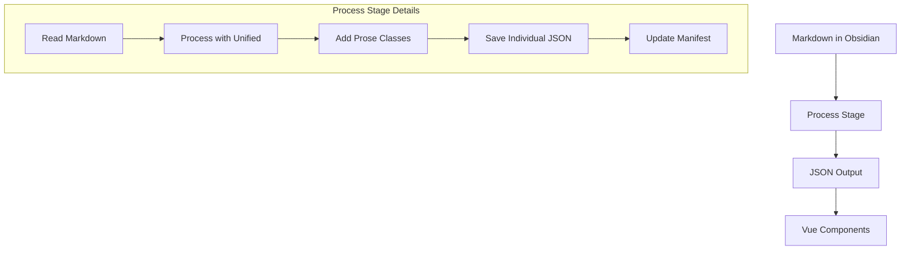

# EJ Fox's Website

A personal website and blog built with **Nuxt 3**, **Vue 3**, and **D3.js**. Content is managed through **Obsidian** and processed through a custom pipeline for seamless publishing. Think of it as a digital garden, but with fewer weeds and more JSON.

**Tech Stack:** Nuxt 3 • Vue 3 Composition API • Tailwind CSS • D3.js • Unified/Rehype • Docker

---

## 🌱 **Getting Started**

### Quick Start

1. **Install dependencies**
   ```bash
   yarn install
   ```
2. **Import content from Obsidian**
   ```bash
   yarn blog:import
   ```
3. **Process markdown to JSON**
   ```bash
   yarn blog:process
   ```
4. **Run the development server**
   ```bash
   yarn dev
   ```
5. **Build for production**
   ```bash
   yarn build
   ```

## 🚀 **Deployment**

The VPS automatically deploys when you push to `main`:

- Cron job runs every 5 minutes (at :00, :05, :10, etc.)
- Automatically pulls changes, installs dependencies, and rebuilds
- Restarts Docker container with health check verification
- Full deployment logs: `/data2/website2/auto-update.log` on VPS
- Typical deployment time: 2-3 minutes from push

## 🔮 **Predictions**

Create cryptographically verifiable predictions with optional deadlines:

**Interactive Mode:**

```bash
yarn predict
```

**CLI Mode:**

```bash
# Time-bound prediction
yarn predict --statement "Bitcoin will hit $200k by 2025" --confidence 75 --deadline 2025-12-31 --resolution "Using CoinGecko closing price"

# Event-based prediction (no deadline)
yarn predict --statement "Next recession will last 18+ months" --confidence 70 --resolution "Using NBER recession dating"
```

**Features:**

- AI-powered quality analysis with OpenRouter integration
- Cryptographic verification (SHA-256, Git commits, PGP signing)
- Both interactive wizard and CLI automation modes
- Optional deadlines for time-bound vs event-based predictions
- Automatic file organization and frontend integration

See [docs/PREDICTIONS.md](docs/PREDICTIONS.md) for complete documentation.

## 🛠️ **Content Pipeline**

### Overview

The site uses a custom content pipeline to transform Markdown files from Obsidian into processed HTML with proper styling. It's like a factory, but for words.

### Processing Flow



### Critical Implementation Details

1. **File Processing**

   ```javascript
   // Each file must be saved individually AND to manifest
   const outputPath = path.join(
     outputDir,
     relativePath.replace(/\.md$/, '.json')
   )
   await fs.writeFile(outputPath, JSON.stringify(result, null, 2))
   ```

   - Individual JSON files: `content/processed/YYYY/post-name.json`
   - Manifest file: `content/processed/manifest-lite.json`

2. **HTML Classes**

   ```javascript
   .use(rehypeAddClassToParagraphs) // Adds max-w-prose to <p> and <blockquote>
   .use(wrapWithProseClasses)       // Wraps in <article class="prose dark:prose-invert max-w-none">
   ```

3. **Common Pitfalls**
   - ❌ Only saving to manifest without individual files
   - ❌ Adding classes in Vue components instead of during processing
   - ❌ Double-wrapping content with prose classes
   - ❌ Missing rehype plugins

### Directory Structure

```
content/
├── blog/
│   ├── YYYY/         # Published posts by year
│   ├── drafts/       # Draft posts
│   ├── robots/       # AI-generated content
│   ├── reading/      # Book notes
│   ├── projects/     # Project docs
│   └── week-notes/   # Weekly updates
└── processed/        # Output JSON files
```

### Metadata Structure

```javascript
// Processed JSON Structure
{
  "content": "<article>HTML content here</article>",
  "html": "<article>HTML content here</article>",
  "title": "Post Title",
  "metadata": {
    // Required metadata
    "date": "2024-01-01T00:00:00.000Z",
    "modified": "2024-01-02T00:00:00.000Z",
    "dek": "Post description",
    "type": "post",

    // Stats (automatically calculated)
    "words": 2077,        // Total word count
    "images": 3,          // Number of images
    "links": 6,           // Number of links
    "codeBlocks": 0,      // Number of code blocks

    // Optional metadata
    "tags": ["tag1", "tag2"],
    "draft": false,       // If true, won't show in lists
    "hidden": false,      // If true, won't be processed
    "inprogress": false,  // If true, shows WIP badge

    // Table of contents (if headers exist)
    "toc": [{
      "depth": 2,
      "text": "Heading"
    }]
  }
}
```

**Important Notes:**

- All metadata MUST be inside the `metadata` object
- Reading time is calculated as `Math.ceil(words / 200)` words per minute
- Stats (words, images, links) are calculated automatically during processing
- Debug logs available in console under "PostMetadata Debug"

### Frontmatter Format

```yaml
---
title: 'Post Title'
date: 2024-01-01
dek: 'A clear, one-sentence description of the post'
tags: ['tag1', 'tag2']

# Optional flags
draft: false # Process but don't display in lists
hidden: false # Don't process at all
inprogress: true # Show WIP badge
---
```

## 🧑‍💻 **Development Details**

### Key Features

- **Content Pipeline**: Obsidian → Markdown → Processed JSON → Vue
- **Predictions System**: Cryptographically verifiable predictions with PGP signing
- **Dynamic Tags**: Usage-frequency sorted journalist pyramid structure
- **Real-time Stats**: Processing with automatic analytics
- **Image Optimization**: Cloudinary integration with responsive srcsets
- **Type-safe APIs**: Full TypeScript coverage

### Environment Variables

```bash
# Required
CLOUDINARY_CLOUD_NAME=
CLOUDINARY_API_KEY=
CLOUDINARY_API_SECRET=

# YouTube Integration
YOUTUBE_API_KEY=      # Your YouTube Data API v3 key
YOUTUBE_CHANNEL_ID=   # Your YouTube channel ID

# Optional
DEBUG=true           # Show processing output
DEBUG_IMPORT=true    # Show import details
DEBUG_POSTS=true     # Show post filtering
```

### Setting Up YouTube Integration

To enable YouTube stats, you'll need two things: a YouTube API key and your channel ID.

#### 1. Getting Your YouTube API Key

```bash
YOUTUBE_API_KEY=your_api_key_here
```

1. Visit [Google Cloud Console](https://console.cloud.google.com)
2. Click "Create Project" (or select existing)
3. Once in your project:
   - Click "Enable APIs and Services"
   - Search for "YouTube Data API v3"
   - Click "Enable"
4. Create API key:
   - Go to "Credentials" in left sidebar
   - Click "Create Credentials" → "API Key"
   - Copy the key that appears
5. (Recommended) Restrict the key:
   - Click "Edit" on your new API key
   - Under "API restrictions" choose "Restrict key"
   - Select "YouTube Data API v3"
   - Save

#### 2. Finding Your Channel ID

```bash
YOUTUBE_CHANNEL_ID=your_channel_id_here
```

Easy way:

1. Go to your YouTube channel
2. Look at the URL - if it's like `youtube.com/channel/UC...` that's your ID
3. If you have a custom URL, you can:
   - Go to YouTube Studio
   - Click Settings → Channel → Advanced Settings
   - Your channel ID is listed there

#### 3. Add to Your Environment

1. Add both to your `.env` file:

```bash
YOUTUBE_API_KEY=AIza...  # Your key from step 1
YOUTUBE_CHANNEL_ID=UC... # Your channel ID from step 2
```

2. If deploying, add these to your deployment environment variables too

That's it! The `/api/stats` endpoint will now include your YouTube stats. 🎥✨

### Logging System

Centralized logging via Grafana Loki:

```bash
LOKI_URL=https://loki.tools.ejfox.com/loki/api/v1/push
```

Captures build logs, runtime errors, and API endpoint issues with structured JSON format.

## 🐛 **Debugging and Troubleshooting**

### Debugging Commands

```bash
# Show processing output
DEBUG=true yarn process

# Check processed files
cat content/processed/YYYY/post-name.json | grep class

# View manifest
cat content/processed/manifest-lite.json | jq
```

## 📜 **License**

MIT License - See LICENSE file for details.

---

And there you have it: a README that's organized, comprehensive, and a little fun. Now go forth and build something awesome. 🌟
