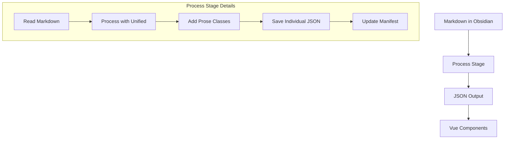

# EJ Fox's Website

A personal website and blog built with **Nuxt 3**, **Vue 3**, and **D3.js**. Content is managed through **Obsidian** and processed through a custom pipeline for seamless publishing. Think of it as a digital garden, but with fewer weeds and more JSON.

---

## 🌱 **Getting Started**

### Quick Start
1. **Install dependencies**  
   ```bash 
   yarn install
   ```
2. **Import content from Obsidian**
   ```bash
   yarn blog:import  
   ```
3. **Process markdown to JSON**
   ```bash
   yarn blog:process
   ```
4. **Run the development server**
   ```bash
   yarn dev
   ```  
5. **Build for production**
   ```bash 
   yarn build
   ```

## 🛠️ **Content Pipeline**

### Overview
The site uses a custom content pipeline to transform Markdown files from Obsidian into processed HTML with proper styling. It's like a factory, but for words.

### Processing Flow


### Critical Implementation Details

1. **File Processing**
   ```javascript
   // Each file must be saved individually AND to manifest
   const outputPath = path.join(outputDir, relativePath.replace(/\.md$/, '.json'))
   await fs.writeFile(outputPath, JSON.stringify(result, null, 2))
   ```
   - Individual JSON files: `content/processed/YYYY/post-name.json`
   - Manifest file: `content/processed/manifest-lite.json`

2. **HTML Classes**
   ```javascript
   .use(rehypeAddClassToParagraphs) // Adds max-w-prose to <p> and <blockquote>
   .use(wrapWithProseClasses)       // Wraps in <article class="prose dark:prose-invert max-w-none">
   ```

3. **Common Pitfalls**
   - ❌ Only saving to manifest without individual files
   - ❌ Adding classes in Vue components instead of during processing
   - ❌ Double-wrapping content with prose classes
   - ❌ Missing rehype plugins

### Content Organization

### Directory Structure
```
content/
├── blog/
│   ├── YYYY/         # Published posts by year
│   ├── drafts/       # Draft posts  
│   ├── robots/       # AI-generated content
│   ├── reading/      # Book notes
│   ├── projects/     # Project docs
│   └── week-notes/   # Weekly updates
└── processed/        # Output JSON files
```

### Metadata Structure
```javascript
// Processed JSON Structure
{
  "content": "<article>HTML content here</article>",
  "html": "<article>HTML content here</article>",
  "title": "Post Title",
  "metadata": {
    // Required metadata
    "date": "2024-01-01T00:00:00.000Z",
    "modified": "2024-01-02T00:00:00.000Z",
    "dek": "Post description",
    "type": "post",
    
    // Stats (automatically calculated)
    "words": 2077,        // Total word count
    "images": 3,          // Number of images
    "links": 6,           // Number of links
    "codeBlocks": 0,      // Number of code blocks
    
    // Optional metadata
    "tags": ["tag1", "tag2"],
    "draft": false,       // If true, won't show in lists
    "hidden": false,      // If true, won't be processed
    "inprogress": false,  // If true, shows WIP badge
    
    // Table of contents (if headers exist)
    "toc": [{
      "depth": 2,
      "text": "Heading"
    }]
  }
}
```

**Important Notes:**
- All metadata MUST be inside the `metadata` object
- Reading time is calculated as `Math.ceil(words / 200)` words per minute
- Stats (words, images, links) are calculated automatically during processing
- Debug logs available in console under "PostMetadata Debug"

### Frontmatter Format
```yaml
---
title: "Post Title"
date: 2024-01-01
dek: "A clear, one-sentence description of the post"
tags: ["tag1", "tag2"]

# Optional flags
draft: false      # Process but don't display in lists
hidden: false     # Don't process at all
inprogress: true  # Show WIP badge
---
```

## 🧑‍💻 **Development Details**

### Tech Stack
- **Frontend**: Nuxt 3, Vue 3 Composition API
- **Styling**: Tailwind CSS, Prose
- **Data**: D3.js for visualizations
- **Content**: Unified/Rehype for Markdown processing

### Key Features
- Markdown processing with code highlighting
- Automatic image optimization via Cloudinary
- Content visibility controls
- Real-time stats processing
- Type-safe API endpoints

### Environment Variables
```bash
# Required
CLOUDINARY_CLOUD_NAME=
CLOUDINARY_API_KEY=
CLOUDINARY_API_SECRET=

# Optional
DEBUG=true           # Show processing output
DEBUG_IMPORT=true    # Show import details
DEBUG_POSTS=true     # Show post filtering
```

### Logging System

The site uses Grafana Loki for centralized logging through Netlify Edge Functions:

```bash
# Required for logging
LOKI_URL=https://loki.tools.ejfox.com/loki/api/v1/push  # Loki endpoint
```

#### Log Types Captured
1. **Build Logs**
   - Build errors and warnings
   - Plugin issues
   - Build process messages

2. **Runtime Logs**
   - Console logs from server-side
   - API endpoint errors
   - User interaction errors

#### Log Structure
```javascript
{
  stream: {
    app: 'website2',
    environment: 'production|preview',
    level: 'error|info',
    source: 'build|runtime'
  },
  values: [
    [timestamp, JSON.stringify({
      message: 'Log message',
      // Additional context...
    })]
  ]
}
```

## 🐛 **Debugging and Troubleshooting**

### Debugging Commands  
```bash
# Show processing output
DEBUG=true yarn process

# Check processed files 
cat content/processed/YYYY/post-name.json | grep class

# View manifest
cat content/processed/manifest-lite.json | jq  
```

## 📜 **License**

MIT License - See LICENSE file for details.

---

And there you have it: a README that's organized, comprehensive, and a little fun. Now go forth and build something awesome. 🌟