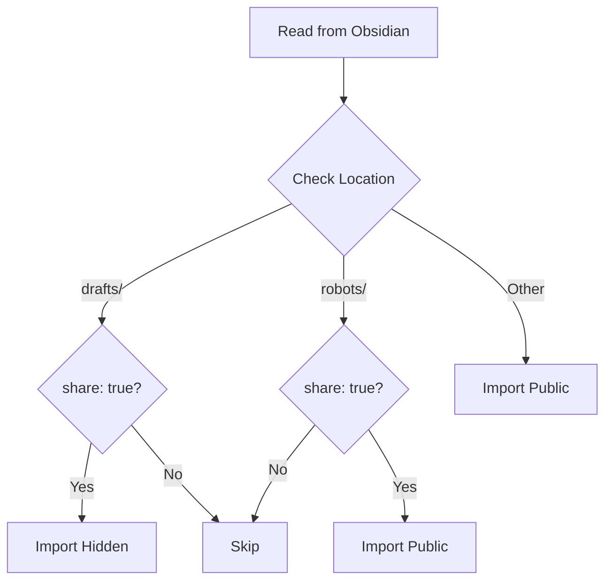

# EJ Fox's Website

A personal website and blog built with Nuxt 3, Vue 3, and D3.js. Content is managed through Obsidian and processed through a custom pipeline for seamless publishing.

## Stats Pipeline

```mermaid
graph TD
    A[useStats.ts] --> B{Cache Check}
    B -->|Stale/Missing| C[Fetch Fresh Data]
    B -->|Valid| D[Use Cached]
    
    C --> E[/api/stats.get.ts]
    E -->|Parallel Fetch| F1[GitHub]
    E -->|Parallel Fetch| F2[MonkeyType]
    E -->|Parallel Fetch| F3[Photos]
    E -->|Parallel Fetch| F4[Health]
    E -->|Parallel Fetch| F5[LeetCode]
    E -->|Parallel Fetch| F6[Chess]
    E -->|Parallel Fetch| F7[RescueTime]
    
    F1 --> G1[github.get.ts]
    G1 --> H1[Process Commits]
    H1 --> I1[Group by Repo]
    H1 --> I2[Parse Types]
    
    F1 & F2 & F3 & F4 & F5 & F6 & F7 --> J[Combine Results]
    J --> K[Cache Response]
    K --> L[Return to Components]
```

### Stats Flow

1. **Client Request (`useStats.ts`)**
   - Checks localStorage for cached data
   - If valid cache exists (< 5 min old), use it
   - Otherwise, fetch fresh data

2. **API Handler (`/api/stats.get.ts`)**
   - Coordinates parallel API requests
   - Handles individual provider failures
   - Combines results into single response

3. **Provider Handlers**
   - **GitHub**: Recent commits, contributions, repo stats
   - **MonkeyType**: Typing speed and accuracy
   - **Photos**: Photography stats and recent uploads
   - **Health**: Activity and fitness data
   - **LeetCode**: Coding challenge progress
   - **Chess**: Game history and ratings
   - **RescueTime**: Productivity tracking

4. **Data Processing**
   - Each provider has its own adapter
   - Transforms raw API data into consistent format
   - Handles error cases and missing data

5. **Caching**
   - Response cached in localStorage
   - 5-minute TTL to prevent API spam
   - Stale data shown while fetching fresh

## Features

- **Content Management**: Write in Obsidian with markdown, publish with git
- **Modern Stack**: Built with Nuxt 3, Vue 3 Composition API, and D3.js
- **Rich Content**: Support for code highlighting, Mermaid diagrams, and interactive elements
- **Image Optimization**: Automatic Cloudinary integration for responsive images
- **Smart Filtering**: Multi-layer content visibility protection
- **Developer Experience**: Hot reload, TypeScript support, and detailed debugging

## Content Management

### Writing Content

Content is written in Markdown within Obsidian and organized into sections:
- **Blog Posts**: Main articles and thoughts
- **Week Notes**: Weekly updates in YYYY-WW format
- **Projects**: Portfolio and project showcases
- **Reading Notes**: Book summaries and reflections
- **Robots**: AI and automation experiments
- **Prompts**: Writing prompts and exercises

### Frontmatter Options

Control post visibility and metadata with frontmatter:
```yaml
---
title: Post Title
date: 2024-01-01
hidden: true/false    # Completely excludes content from processing
share: true/false     # Required for drafts/robots
dek: Description      # Required for week notes
---
```

## Content Processing Pipeline

### 1. Import Stage (import.mjs)

First line of defense - reads from Obsidian vault and performs initial filtering:


Key Features:
- **Location-based filtering**: Different rules for drafts/, robots/, and other content
- **Share status checking**: Required for sensitive directories
- **Metadata generation**: 
  - Word count
  - Reading time
  - Image count
  - Link count
- **Debug mode**: Set `DEBUG_IMPORT=true` for detailed logging

### 2. Processing Stage (processMarkdown.mjs)

Transforms content for web display with advanced features:

**Content Processing:**
- Markdown to HTML conversion
- Syntax highlighting via Shiki
- Mermaid diagram rendering
- Cloudinary image optimization
- Wiki-style internal linking

**Special Features:**
- Table of Contents generation
- Header slug creation
- Social platform icon integration
- AI2HTML graphic embedding

**Metadata Processing:**
- Robots meta tag generation
- Reading time calculation
- Content categorization
- Link analysis

**Debug Options:**
```bash
# Show detailed processing information
DEBUG_PROCESS=true

# Track content transformation
DEBUG_POSTS=true
```

### Content Visibility Matrix

| Location    | share: true | hidden: true | Result        |
|------------|-------------|--------------|---------------|
| /drafts/   | No          | Any          | Skipped       |
| /drafts/   | Yes         | No           | Hidden Import |
| /robots/   | No          | Any          | Skipped       |
| /robots/   | Yes         | No           | Public Import |
| /week-notes| N/A         | No           | Public Import |
| /* (other) | N/A         | No           | Public Import |

### 3. Runtime Stage (useProcessedMarkdown.ts)

Final line of defense - handles dynamic content filtering:
- Triple-checks hidden status before serving
- Applies visibility rules
- Sorts and groups content
- Provides composables for content access
- Manages special section requirements

## Visibility Rules

### Regular Posts
- Visible by default
- Setting hidden: true prevents the post from being processed at all

### Drafts & Robots
- Hidden by default
- Require share: true to be processed
- Setting hidden: true overrides share status

### Week Notes
- Visible by default if they have a description
- Use YYYY-WW filename format
- Setting hidden: true prevents processing

## Development

### Prerequisites
- Node.js 18+
- Yarn
- Obsidian vault with content

### Setup
1. Clone the repository
2. Install dependencies: `yarn install`
3. Copy .env.example to .env and configure
4. Run development server: `yarn dev`

### Content Processing
1. Write content in Obsidian
2. Run `yarn process` to rebuild content
3. Changes appear in development server

### Environment Variables
- `CLOUDINARY_*`: Image optimization settings
- `DEBUG_IMPORT`: Show import process details
- `DEBUG_PROCESS`: Show markdown processing details
- `DEBUG_POSTS`: Show post filtering details

## License

MIT License - See LICENSE file for details